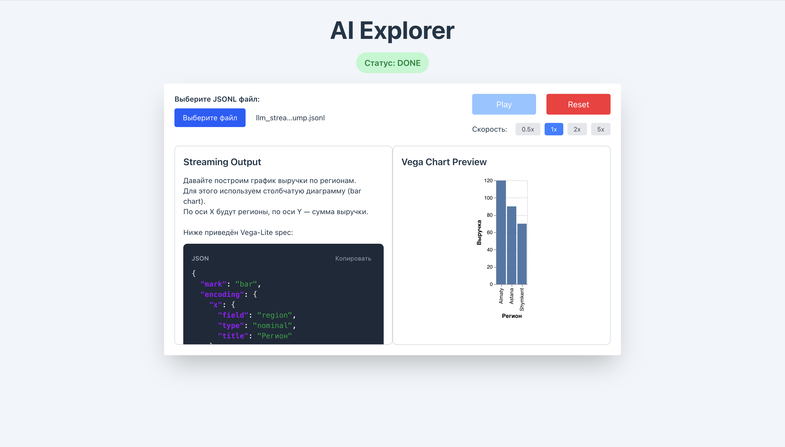
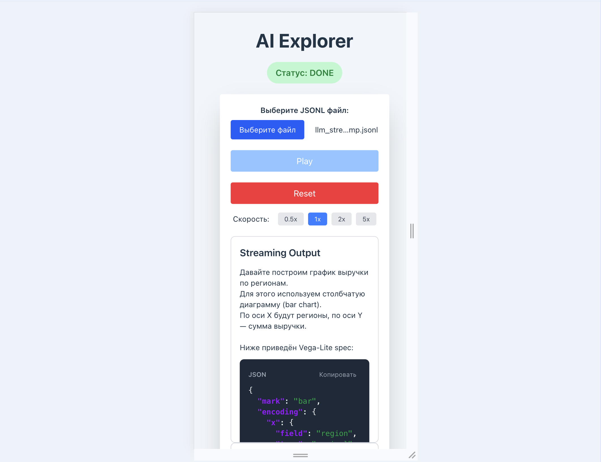
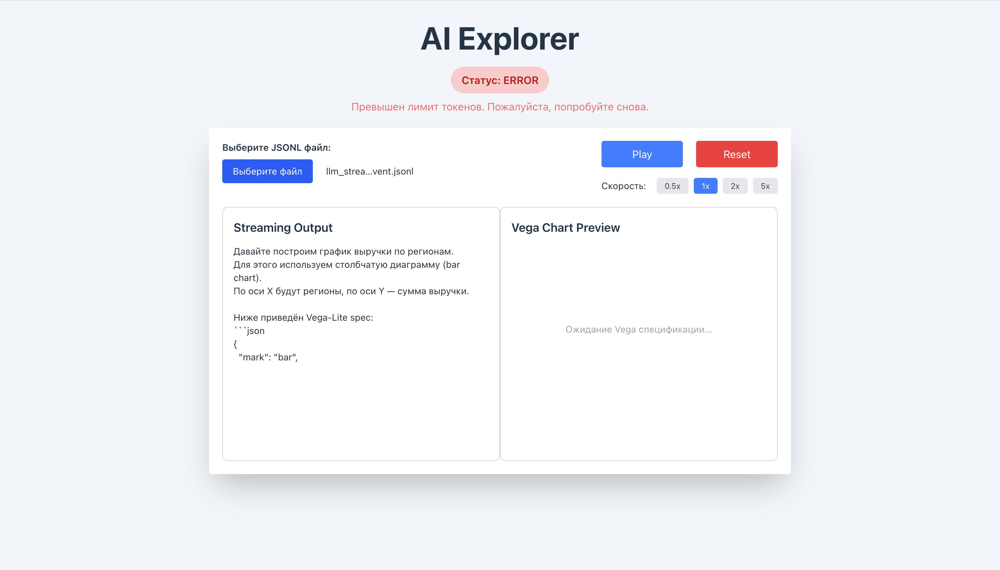

# AI Explorer

Приложение для эмуляции SSE-потока LLM и визуализации Vega-Lite графиков.

[Ссылка на приложение](https://page-of-ai-explore.vercel.app)

## Screenshots

### Desktop


### Responsive layout (mobile)


### Error state


## Как запустить

### Установка и запуск

```bash
# Установить зависимости
npm install

# Запустить в режиме разработки
npm run dev

# Собрать для продакшена
npm run build
```

Приложение откроется по адресу `http://localhost:5173`

## Как использовать

1. **Загрузите JSONL файл** с помощью кнопки "Выберите JSONL файл"
2. **Нажмите Play** для начала воспроизведения потока
3. **Наблюдайте**:
   - Левая панель — потоковый вывод текста
   - Правая панель — превью Vega-Lite графика
4. **Управление**: используйте кнопки Stop и Reset по необходимости

## Архитектура решения

### Обработка LLM streaming

**Хук `useSSEPlayer`** эмулирует Server-Sent Events с регулируемой скоростью:

```typescript
// Построчное чтение JSONL
const lines = dump.split('\n').filter(line => line.trim());

// Воспроизведение с задержкой 50-150ms (регулируется через playbackSpeed)
const baseDelay = Math.random() * 100 + 50;
const adjustedDelay = baseDelay / playbackSpeed; // 0.5x - 5x
setTimeout(playNextLine, adjustedDelay);

// Склеивание токенов
if (event.event === 'token') {
  setStreamedText(prev => prev + event.data.delta);
}
```

**Обработка событий:**
- `token` - добавляет delta к тексту
- `done` — завершает стрим
- `error` — показывает ошибку

### Извлечение Vega спецификации

**Функция `extractVegaSpec`** ищет JSON в тексте:

```typescript
// Регулярное выражение для поиска JSON блоков
const jsonBlockRegex = /```json\s*([\s\S]*?)\s*```|(\{[\s\S]*?\})/g;

// Валидация: проверяем наличие mark и encoding
if (parsed.mark && parsed.encoding) {
  return parsed as VegaSpec;
}
```

**Особенности:**
- Работает с JSON, обёрнутым в ```json блоки
- Работает с чистым JSON
- Парсит JSON по мере накопления чанков
- Валидирует обязательные поля (`mark`, `encoding`)
- Устойчив к ошибкам парсинга

### Рендеринг Vega-Lite

**Компонент `VegaChart`:**
- Динамически загружает библиотеки Vega через CDN
- Внедряет хардкодированные данные:
  ```typescript
  const DEFAULT_DATA = [
    { region: "Almaty", revenue: 120 },
    { region: "Astana", revenue: 90 },
    { region: "Shymkent", revenue: 70 }
  ];
  ```
- Автоматически обновляет график при изменении спецификации
- Очищает контейнер при размонтировании

## Технический стек

- **React 18** + **TypeScript**
- **Vega-Lite** (через vega-embed CDN)
- **Tailwind CSS** (стилизация)
- **Vite** (сборка)

## Структура проекта

```
src/
├── components/
│   ├── AIExplorer.tsx      # Главный компонент
│   ├── Controls.tsx        # Панель управления
│   ├── StreamingOutput.tsx # Вывод потока с подсветкой JSON
│   └── VegaChart.tsx       # Рендеринг Vega графика
├── hooks/
│   └── useSSEPlayer.ts     # Хук для эмуляции SSE
├── config/
│   └── vega.ts             # Конфигурация Vega (данные, CDN URLs)
├── constants/
│   └── index.ts            # Константы приложения(задержки, скорость, цвета)
├── utils/
│   └── extractVegaSpec.ts  # Извлечение и валидация Vega спецификации
├── types/
│   ├── see.ts              # TypeScript типы для SSE 
│   ├── vega.ts             # TypeScript типы для Vega 
│   └── global.d.ts         # Глобальные типы (window.vegaEmbed)
└── App.tsx                 # Точка входа
```

## Дополнительно

- **Подсветка JSON** в потоковом выводе
- **Копирование Vega spec** одним кликом
- **Скорость воспроизведения** — регулируемая скорость стрима (0.5x - 5x)
- **Адаптивный дизайн** для мобильных устройств
- **Визуальная индикация статуса** (idle/streaming/done/error)
- **Анимация** курсора во время стриминга

## Обработка ошибок

- Валидация загруженного файла
- Try-catch для парсинга JSONL строк
- Graceful fallback при ошибках рендеринга Vega
- Отображение понятных сообщений об ошибках пользователю

## Примечания

- Приложение полностью работает на клиенте (без backend)
- Использует случайную задержку 50-150ms для реалистичной эмуляции
- Vega библиотеки загружаются динамически при первом рендеринге графика
- Данные для графика захардкожены согласно требованиям задачи